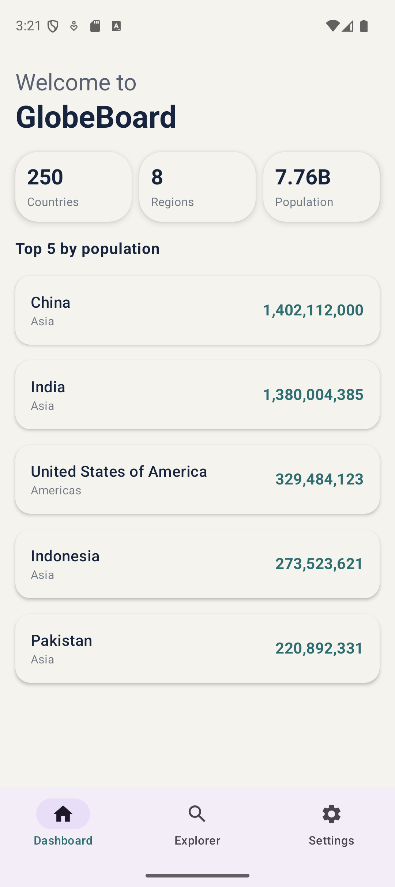
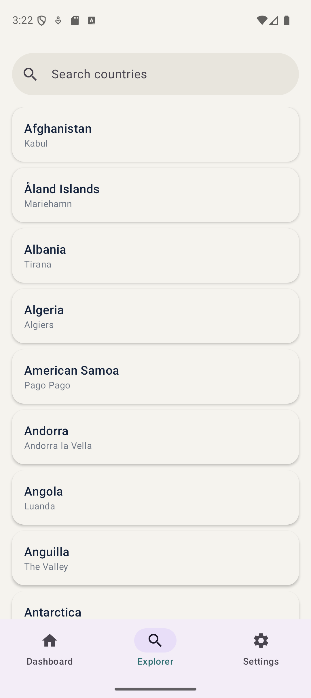
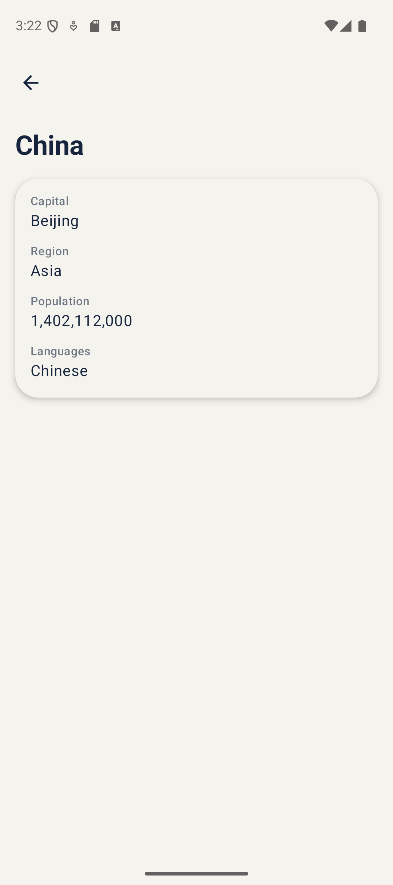

# GlobeBoard

A Kotlin Multiplatform demo app built with **Compose Multiplatform**, targeting **Android** and **iOS** from a
shared codebase. Built as a portfolio project to explore KMP development patterns.

## About the App

GlobeBoard is a small country data explorer with three screens:

- **Dashboard** - summary statistics (total countries, total regions, total population) and a top 5 countries by
  population list.
- **Explorer** - a searchable, filterable list of all countries, with debounced search.
- **Country Detail** - capital, region, population, and languages for a selected country.

Data comes from the free, keyless [countries.dev](https://countries.dev) REST API.

## Architecture

The project follows a pragmatic, simplified Clean Architecture, structured into three top-level packages inside the
shared module:

- **`core`** 0 main app infrastructure: network client setup, dependency injection modules,
  navigation graph, theming, and shared constants/utilities.
- **`common`** 0 logic and data shared across multiple features (currently: everything related to `Country` - the
  API service, repository, and its domain interface).
- **`features`** - one package per screen (`dashboard`, `explorer`, `countryDetail`, `settings`), each with its own
  `presentation` layer (ViewModel + Composable screen + small UI-only components).

A few deliberate simplifications, made consciously rather than by default:

- **No DTO/domain-model split.** The `Country` model is `@Serializable` and lives directly in the `data` layer,
  deserialized straight from the API response. With a single data source and no meaningful divergence between the
  API shape and what the UI needs, a separate mapping layer would have added boilerplate without real benefit.
- **No use case layer.** ViewModels call the repository directly. Repositories already have a single, clear
  responsibility here; a use case would mostly forward the call.
- **Repository still has an interface + implementation split** (`CountryRepository` / `CountryRepositoryImpl`),
  since that boundary pays for itself even at this scale.

## Tech Stack

- Kotlin Multiplatform
- Compose Multiplatform (Material 3)
- Compose Navigation Multiplatform (type-safe routes)
- Ktor (networking - OkHttp engine on Android, Darwin engine on iOS)
- kotlinx.serialization (JSON parsing)
- kotlinx.coroutines (StateFlow, Flow operators - `combine`, `debounce`)
- Koin (dependency injection)
- AndroidX ViewModel

## Screenshots

| Dashboard                                      | Explorer                                     | Country Detail                                          |
|------------------------------------------------|----------------------------------------------|---------------------------------------------------------|
|  |  |  |

## Running the App

- **Android:** open the project in Android Studio / IntelliJ, sync Gradle, run the `androidApp` configuration.
- **iOS:** the shared module is written to be fully multiplatform (Ktor Darwin engine, Koin init entry point in
  `iosMain`), but the iOS app target wasn't built out or tested locally due to lack of access to macOS/Xcode.

No API key or configuration is required - countries.dev is free and keyless.
